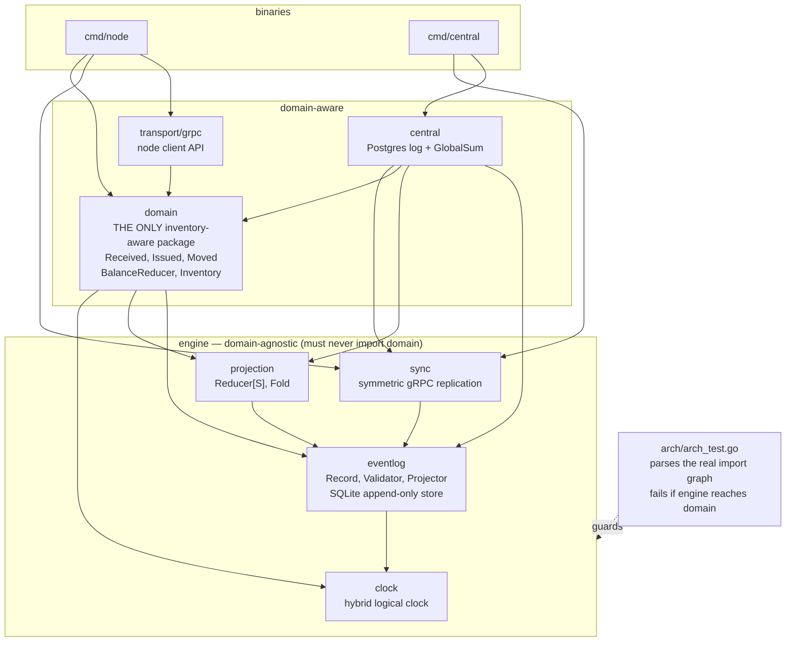
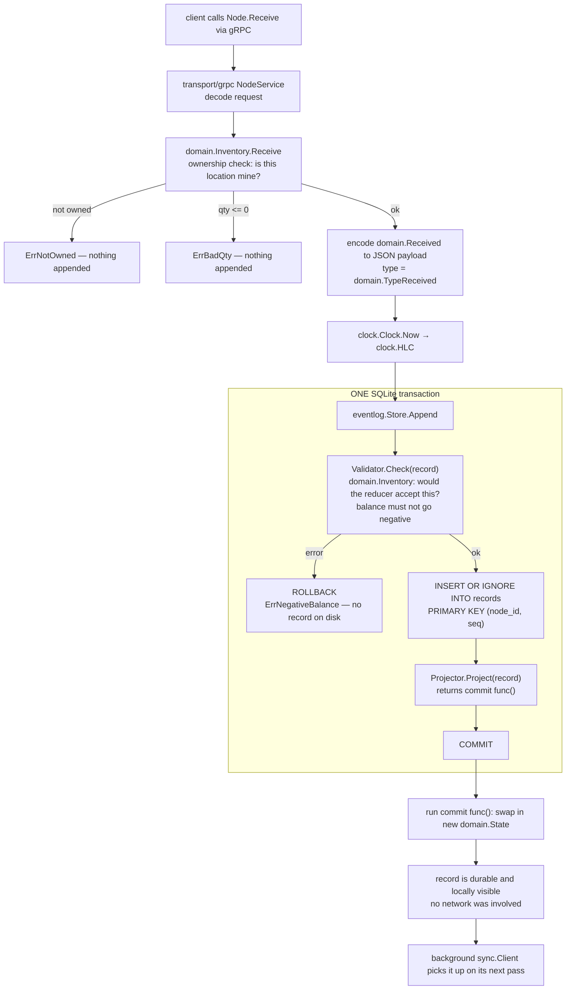
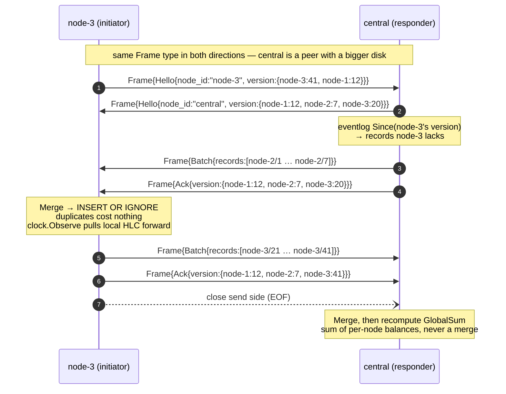

# Architecture

Three diagrams and the prose to read them by. If you only have five minutes,
read the package diagram and the event lifecycle; the sync sequence is the
detail underneath.

## Packages

The dividing line runs down the middle of this diagram: four packages know
nothing about inventory, one package is the entire domain, and two thin layers
join them.



Read the arrows: everything in `engine` points only at other `engine` packages
or the standard library. Nothing points right-to-left. `arch/arch_test.go`
enforces that with `golang.org/x/tools/go/packages`, so the claim is verified on
every `go test` rather than maintained by good intentions. See
[ADR 0005](adr/0005-domain-agnostic-engine.md).

`central` is allowed to import `domain` because it must interpret payloads to
compute a global sum — it is an application of the engine, not part of it.

## Event lifecycle

One command, start to finish. The important part is the box: validate, append
and project happen inside a single SQLite transaction, so a rejected command
leaves nothing behind and derived state can never disagree with the log.



Two things a reader should take from this:

- The command path never touches the network. A node with no connectivity, or no
  central configured at all, serves every call in this diagram.
- `Validator.Check` is the seam that lets the engine enforce an invariant it
  cannot understand. `eventlog` knows only that a `Check` returned an error.

Rebuilding state on startup is the same machinery run backwards:
`projection.Fold(ctx, store, domain.BalanceReducer{})` replays every record
through the reducer. An unrecognised `Type` is `eventlog.ErrUnknownType` and
stops the process — never a skipped record.

## Sync sequence

`sync.Exchange` is one function used by both sides. The only difference between
the two participants is the `initiator bool` argument: who speaks first.



If that stream dies anywhere — step 3, step 7, mid-batch — nothing needs
repairing. Both sides keep whatever they had already committed, and the next
attempt starts again from `Hello` with current version vectors. Re-delivered
records hit the `(node_id, seq)` primary key and vanish. That is the entire
resumption story, and it is a consequence of
[ADR 0002](adr/0002-sqlite-local-log.md) rather than code anyone had to write.

A version vector that has gone *backwards* (a peer restored from an older
backup) is equally harmless: it asks for records it already has, and gets them
again for free.

## Where your domain plugs in

Two interfaces, and a command encoder:

```go
// reading
type Reducer[S any] interface {
	Zero() S
	Apply(state S, r eventlog.Record) (S, error)
}

// writing, called inside the append transaction
type Validator interface {
	Check(r Record) error
}
```

[swapping-the-domain](swapping-the-domain.md) does it end to end with a second
toy domain, in compiling, tested code. [limitations](limitations.md) lists what
this architecture deliberately does not do.
